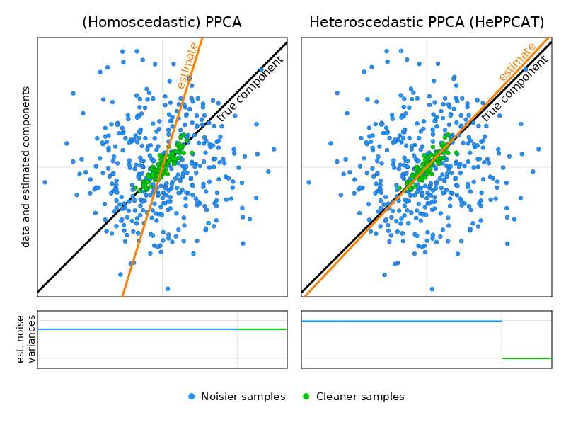

# HePPCAT: HEteroscedastic Probabilistic PCA Technique

[](https://www.repostatus.org/#active)
[](https://github.com/dahong67/HePPCAT.jl/actions)
[](https://codecov.io/gh/dahong67/HePPCAT.jl)

> :wave: *This package provides research code and work is ongoing.
> If you are interested in using it in your own research,
> **I'd love to hear from you and collaborate!**
> Feel free to write: dahong67@wharton.upenn.edu*

Please cite the following paper for this technique:
> David Hong, Kyle Gilman, Laura Balzano, Jeffrey A. Fessler.
> "HePPCAT: Probabilistic PCA for Data with Heteroscedastic Noise", 2021.
> [http://arxiv.org/abs/2101.03468]().

In BibTeX form:
```bibtex
@misc{hgbf2021heppcat,
  title  = "HePPCAT: Probabilistic PCA for Data with Heteroscedastic Noise", 
  author = "David Hong and Kyle Gilman and Laura Balzano and Jeffrey A. Fessler",
  year   = 2021,
  url    = "https://arxiv.org/abs/2101.03468",
}
```

## What is Heteroscedastic Probabilistic PCA (HePPCAT)?

**HePPCAT** is a probabilistic **Principal Component Analysis (PCA)** technique
**for data that has samples with heterogeneous quality**,
i.e., noise that is *[heteroscedastic](https://en.wikipedia.org/wiki/Heteroscedasticity) across samples*.

**Illustration:**
data points
with a group of *noisier samples* (blue points)
and a group of *cleaner samples* (green points).



Homoscedastic PPCA estimates *only one* noise variance for the whole data,
and treats samples as though they were all equally noisy.
Recovery of latent components can degrade a lot due to the noisier samples,
even though the rest of the samples are relatively clean.

**HePPCAT estimates latent components along with *separate* noise variances for each group.
It accounts for heterogeneous quality among the samples and is generally more robust.**

*It's not just a ["cool cat"](https://en.wiktionary.org/wiki/hepcat)!*

## Quick start: how to use HePPCAT

**Installation:**
this package <!-- is registered and --> can be installed
via the [package manager](https://docs.julialang.org/en/v1/stdlib/Pkg/).
<!-- ```julia (@v1.5) pkg> add HePPCAT``` -->
```julia
(@v1.5) pkg> add https://github.com/dahong67/HePPCAT.jl
```

**Main function:**
the main function is called `heppcat`.
Type `?heppcat` for the [docstring](https://docs.julialang.org/en/v1/manual/documentation/#Accessing-Documentation).
```julia
help?> heppcat
search: heppcat HePPCAT HePPCATModel

  heppcat(Y,k,iters;init=homppca(Y,k))

  Estimate probabilistic PCA model for noise that is heteroscedastic across samples.

  Inputs are:

    •    Y : list of matrices (each column is a sample)

    •    k : number of factors

    •    iters : number of iterations to run

    •    init : initial model (will be modified in-place)

  Output is a HePPCATModel object.
```
It returns a `HePPCATModel`:
```julia
help?> HePPCATModel
search: HePPCATModel

  HePPCATModel{S<:Number,T<:Real}

  Model parameters for probabilistic PCA with noise that is heteroscedastic across samples.
  This is the return type of heppcat(_), the corresponding estimation function.

  Properties
  ≡≡≡≡≡≡≡≡≡≡≡≡

    •    F  :: Matrix factor matrix (computed via F = U*sqrt(Diagonal(λ))*Vt)

    •    U  :: Matrix{S} eigenvectors of factor covariance F*F'

    •    λ  :: Vector{T} eigenvalues of factor covariance F*F' (spike eigenvalues)

    •    Vt :: Matrix{S} (transposed) eigenvectors of F'*F (i.e., right singular vectors of F)

    •    v  :: Vector{T} noise variances
```
See `demo/` directory and paper code repo **(coming soon!)** for some examples!
